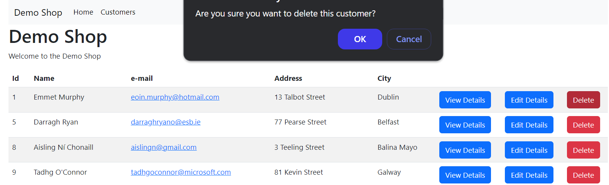

# Demo Shop - Java Spring-boot application

This is a simple Java Spring-boot application that demonstrates the use of Spring Data JPA, Spring Boot DevTools, Thymeleaf, and Maven.

## Tools used

- [IntelliJ IDEA](https://www.jetbrains.com/idea/)
- [Spring Initializr](https://start.spring.io/)
- [GitHub](https://github.com)



> Customers Page

## Run

Update the [application.properties](src/main/resources/application.properties) file with your database connection details.

```properties
spring.application.name=demo-shop-spring-boot-java

spring.datasource.url=jdbc:mysql://localhost:3306/demo_shop_spring_boot_2024
spring.jpa.properties.hibernate.dialect=org.hibernate.dialect.MySQL8Dialect
spring.datasource.username=root
spring.datasource.driver-class-name=com.mysql.cj.jdbc.Driver
server.port=8083

spring.datasource.password=INSERT_YOUR_PASSWORD


---

Copyright &copy; Mark Crowe 2024. All rights reserved.
